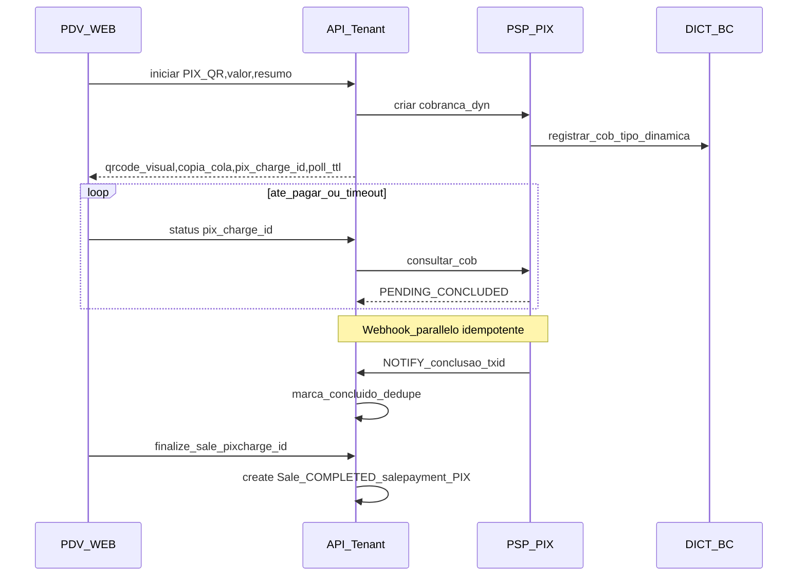

# Plano: pagamento PIX com QR no PDV e via maquinha

> Copia registada neste repositório para poder versionar em Git. O mesmo conteúdo pode existir no Cursor em `pix_pdv_qr_e_maquinha_*.plan.md` (pastas `.cursor/plans`).

## Situação atual no GestorVend

- O enum [`PaymentMethod`](apps/api/prisma/tenant/schema.prisma) já inclui **`PIX`**; [`SalePayment`](apps/api/prisma/tenant/schema.prisma) grava método + valor + parcelas.
- O PDV ([`SalesPage.tsx`](apps/web/src/pages/SalesPage.tsx)) trata **`PIX`** como qualquer outra forma: o operador **informa valores** até fechar o total; **não** há geração de BR Code, nem integração PSP, nem vínculo com transação externa.
- A conclusão da venda ocorre em [`sales.service.ts`](apps/api/src/sales/sales.service.ts) com normalização das parcelas até bater no total da venda (fluxo síncrono “tudo decidido antes do POST”).
- Este plano mantém esse modelo para **fallback** (“PIX declarado”), mas acrescenta **dois fluxos opcionais** orientados ao mercado brasileiro: **QR na tela** e **captura pela maquinha**.

## Objetivos

1. **QR na tela do PDV**: gerar cobrança PIX (**PIX Cobrança** com QR dinâmico `BR Code`, padrão Banco Central), exibir QR e status de pagamento, e só então registrar a venda (ou mover de `pending` para `completed`) com comprovação adequada ao PSP.
2. **Maquinha (terminal de adquirência/banco)**: permitir fluxo onde o cliente paga PIX **no próprio PIN pad** ou app do credenciador (Stone, Rede, Cielo Pagar.me, Sicredi Pag, etc.), com forma de consolidar valor + confirmação no GestorVend **sem obrigar uso do QR gerado pela aplicação** — típico via **SDK/execução de transação POS** ou, na ausência de integração nativa MVP, fluxo guiado (“informar ID da transação / confirmar pago”).
3. Convivência: operador deve escolher **modo PIX** onde fizer sentido (configuração por empresa ou seleção por venda antes de iniciar cobrança).

## Decisão de produto (escopo técnico em duas pontas)

| Canal | Como funciona conceitualmente | Dependência típica |
|--------|-------------------------------|---------------------|
| **QR na aplicação** | API de PSP (conta PJ + certificado/Chave PIX) criando cobrança com **txid** e retorno do **PIX Copia e Cola** / payload EMV para QR | Webhook PIX + consulta REST de status (**GET cobrança/v2/cob/:txid** no padrão DICT, conforme instituição escolhida) |
| **Maquinha** | Transação de **pagamento PIX** comandada pela **PIN pad**/app do acquirer ou pela **Stone/Cielo/Rede** integração | SDK “POS integrado” ou protocolo próprio da credenciadora; **não** é o mesmo contrato SPI do PSP direto gerador de QR Cobrança (embora o destino financeiro possa convergir) |

O plano deve tratar estas duas frentes como **integrações distintas** acopladas por uma camada interna **`PixPaymentOrchestrator`** (abstrações `createCharge`, `getStatus`, `registerTerminalConfirmation`).

## Modelo de dados (tenant — sugerido)

- **`PixCharge`** (ou `SalePixIntent`): `id`, `tenantId`/implícito, `saleDraftId` ou `saleId` (FK opcional até finalizar), `amount`, currency BRL, `txid`, `copiaECola`/hash do EMV truncado para busca (nunca logar inteiro sem necessidade), `status` (`PENDING` | `CONCLUDED` | `EXPIRED` | `CANCELLED`), `expiresAt`, `pspProvider` (`EFIPAY|SICOOB|CUSTOM…`), ids externos, timestamps, `confirmedAt`, `payloadWebhookLast` opcional auditoria minimal.
- Opcional **`Sale`** estados **`DRAFT`/`PENDING_PAYMENT`** enquanto aguarda PIX — hoje já existe [`SaleStatus`](apps/api/prisma/tenant/schema.prisma) (`DRAFT/COMPLETED/CANCELLED`); avaliar usar **`COMPLETED`** só após confirmação ou introduzir `PENDING_PIX`/`AWAITING_SETTLEMENT` se quiser relatório claro antes de auditoria fiscal.
- **`SalePayment`**: campo opcional `pixChargeId` ou `externalTxnId` (string maquinha/acquirer transaction id).

## Fluxo A — PIX com QR na tela do PDV

- **Polling com backoff + webhook**: webhook exposto em **`POST /webhooks/psp/:provider`** por tenant (**URL com segredo/rota tenant** ou assinatura HMAC). Idempotência com `transactionIdBank`/`e2eid` quando disponível nos payloads.
- **UI PDV**: após escolher “PIX – QR nesta tela”, painel fullscreen com QR (lib `react-qr-code` ou SVG), texto copia-e-cola, timer de expiração, botões “Cancelar cobrança” e “Cliente já pagou (atualizar)”.
- **Segurança**: credenciais PSP e certificados mTLS ficam armazenados **como empresa/tenant secreto**, nunca na web; apenas token de curta duração se necessário.

## Fluxo B — PIX na maquinha

Dois níveis de maturidade (planejar ambos, implementar incrementalmente):

1. **Integrado (preferido quando houver acquirer homologado)**: usar **SDK/bridge** oficial (ex.: módulos de **pagamento PIX no POS** Stone/Rede/Cielo…) na estação física onde roda PDV desktop ou aplicativo intermediário “bridge” instalado ao lado — o servidor GestorVend recebe apenas **valor + resultado** (+ `authorizationCode`/`nsu`/id transação PIX). Fluxo típico: PDV solicita ao bridge “capturar PIX R$ X”; usuário opera na maquinha; bridge retorna sucesso para o SPA via WebSocket/long-poll localhost ou aplicativo Electron futuro — **este item pode ser marcado como fase tardia se o PDV atual for apenas browser**.
2. **MVP pragmático (browser-only)**: após cliente pagar na maquinha sob orientação da loja o operador em **PIX (maquinha)** confirma no PDV clicando **“Confirmar PIX na maquinha”** opcionalmente com campo **referência externa curta** (últimos dígitos e2e, NSU, ou foto do comprovante como anexo só em fase posterior). Persistir `sale` com `PIX` e `terminalRef` opcional para conciliação. **Risco operacional reconhecido** — mitigação posterior com integração do item 1.

## Configurações (empresa / PDV)

- Em **Empresa** ou novo bloco **Pagamentos PIX**: modo preferido (**QR PSP** / **maquinha apenas** / **ambos**), credenciais homologação/produção, Chave PIX vincular à conta recebedora, tolerância de timeout (seconds), webhook URL público já validado.
- **Feature flag**: desativar PSP em homolog até certificado ok.

## API Nest (nova superfície sugerida)

- `POST /payments/pix/charges` — cria cobrança; retorna payload para QR.
- `GET /payments/pix/charges/:id` — estado para polling.
- `DELETE /payments/pix/charges/:id` — cancelar cobrança aberta antes de efetivar venda (se PSP permitir).
- `POST /webhooks/psp/:provider` — apenas **sem JWT** público mas com validação forte (assinatura payload + whitelist IP opcional conforme PSP).
- `POST /sales` — estender opcionalmente com `finalizeFromPixChargeId` ou fluxo duas-etapas: `POST /sales/draft-pix` + `POST /sales/:id/confirm-pix`.

## Front-end ( [`SalesPage.tsx`](apps/web/src/pages/SalesPage.tsx) overlay de pagamentos)

- No tile **Pix**, submenu ou segundo passo: **“Gerar QR (PIX)”** vs **“PIX na maquinha”**.
- Estado local + React Query polling `charges/:id`; bloqueio de navegação enquanto PENDING opcional UX.
- Conferir comportamento atual de teclas de atalho (1–4) quando houver dois submodos.

## Conformidade e operação

- **LGPD/logs**: mascarar CPF/Chave onde não necessários; auditoria apenas metadados.
- **Financeiro/caixa**: movimentações de entrada em caixa aberto devem continuar compatíveis com [`CashRegisterSession`](apps/api/prisma/tenant/schema.prisma) — ao finalizar PIX confirmado gerar entrada **IN** método correspondente onde hoje apenas “declara método” ao fechar venda (revalidar [`sales.service.ts`](apps/api/src/sales/sales.service.ts) após entrada assíncrona).
- **Conciliação diária**: relatório PIX separando **pspTxId / e2eid** quando existir.

## Fases de entrega

1. **Desenhar contratos internos + migrações** `PixCharge` e flags em `Sale`/`SalePayment`.
2. **Escolha de PSP inicial** (recomenda-se documentação aberta forte: Efipay / BB / Sicredi segundo contrato já existente do cliente) — **homolog apenas**.
3. **QR Cobrança + webhook + polling** funcionando ponta-a-ponta até concluir venda.
4. **UI PDV fluxo PIX maquinha (MVP operador)** com referência externa opcional + indicadores UX.
5. **Integração terminal/SDK** onde houver requisito de hardware e distribuição cliente.
6. **Produção** após checklist (certificado, chave webhook HTTPS, métricas, alertas de timeout).

## Riscos e mitigações

- **Webhook inacessível** (localhost dev): usar **tunnel** (ngrok) em dev; em prod exigir domínio válido TLS.
- **Timeout cliente**: política cancelar cobrança e não finalizar estoque/caixa até confirmação explícita.
- **PIN pad apenas browser**: integração física pode exigir **app auxiliar**, **Electron**, ou modo “confirmação manual” inicial — comunicar ao cliente antes do go-live.
